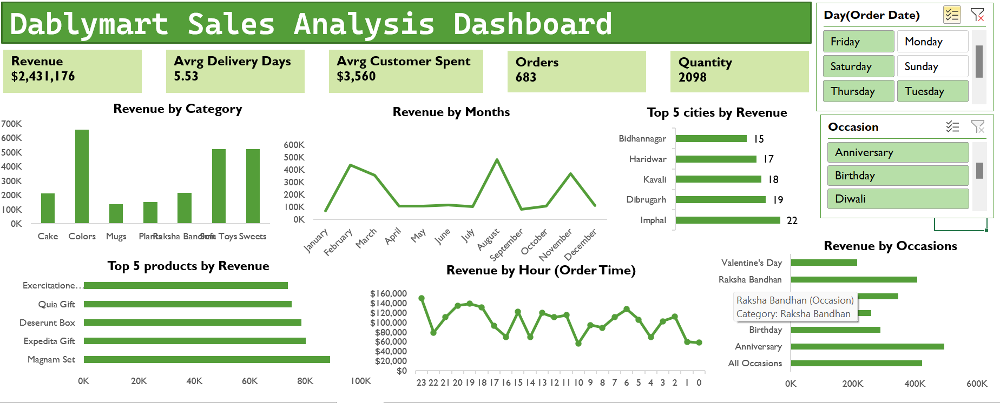

# Ferns-and-Patels-Sales-Analysis-in-Excel
Ferns and Patels Sales Analysis in Excel

## Problem Statement: Ferns and Petals Sales Analysis

### You have been given a dataset from FNP (Ferns and Petals) that specializes in sending gifts for
various occasions like Diwali, Raksha Bandhan, Holi, Valentine's Day, Birthdays, and
Anniversaries. The dataset contains details about the products, orders, customers, and relevant
dates. Your task is to analyze this dataset to uncover key insights related to sales trends,
customer behavior, and product performance.
Create a dashboard and answer the following key business questions to help the company
improve its sales strategy and optimize customer satisfaction:

1. Total Revenue: Identify the overall revenue.
2. Average Order and Delivery Time: Evaluate the time taken for orders to be delivered.
3. Monthly Sales Performance: Examine how sales fluctuate across the months of 2023.
4. Top Products by Revenue: Determine which products are the top revenue generators.
5. Customer Spending Analysis: Understand how much customers are spending on
average.
6. Sales Performance by Top 5 Product: Track the sales performance of top 5 products.
7. Top 10 Cities by Number of Orders: Find out which cities are placing the highest
number of orders.
8. Order Quantity vs. Delivery Time: Analyze if higher order quantities impact delivery
times.
9. Revenue Comparison Between Occasions: Compare revenue generated across
different occasions.
10. Product Popularity by Occasion: Identify which products are most popular during
specific occasions.

## 🧩 Project Overview

 Sales Dashboard summarizes the company's sales metrics through an engaging and user-friendly layout. With real-time filtering capabilities, it enables business users to drill down into revenue data by **category, city, month, hour**, and **occasion**.

This dashboard is designed for **quick decision-making**, performance tracking, and identifying sales trends or high-performing product segments.

---

## 🎯 Project Goal

- Present an interactive sales analysis using **Microsoft Excel** tools.
- Identify top-performing **products**, **categories**, **cities**, and **occasions**.
- Analyze **order patterns** by **month**, **hour**, and **day of the week**.
- Support business decisions with **data-driven insights**.

---

## 📌 Key Insights

- **Total Revenue**: `$2,431,176`
- **Average Delivery Days**: `5.53`
- **Average Customer Spend**: `$3,560`
- **Total Orders**: `683`
- **Total Quantity Sold**: `2,098`

### 📊 Revenue by Category:
- **Colors** generated the highest revenue (over 600K).
- **Soft Toys** and **Sweets** followed closely behind.

### 🕓 Revenue by Hour:
- Peak order times occurred around **23:00**, **20:00**, and **17:00 hours**.

### 📅 Revenue by Month:
- **February**, **March**, **August**, and **November** were strong sales months.

### 🌇 Top 5 Cities by Revenue:
- **Imphal**, **Dibrugarh**, and **Kavali** were top revenue contributors.

### 🎁 Top Products by Revenue:
- Highest-selling items include:
  - **Magnam Set**
  - **Expedita Gift**
  - **Deserunt Box**
  - **Quia Gift**
  - **Exercitatione...**

### 🎉 Revenue by Occasion:
- **Anniversary** and **Raksha Bandhan** occasions generated over **500K** in revenue.
- **Birthday** and **Valentine's Day** also contributed significantly.

---

## 🛠️ Technologies Used

| Tool/Feature           | Purpose                                |
|------------------------|----------------------------------------|
| **Excel Pivot Tables** | Aggregation & summary of data          |
| **Power Query**        | Data cleaning and transformation       |
| **Power Pivot**        | Data modeling and relationship building|
| **Slicers**            | Interactive filtering by day & occasion|
| **Conditional Formatting** | Highlighting KPIs and outliers    |
| **Charts**             | Visual representation of insights      |

---

## 📂 Dashboard Preview

---
